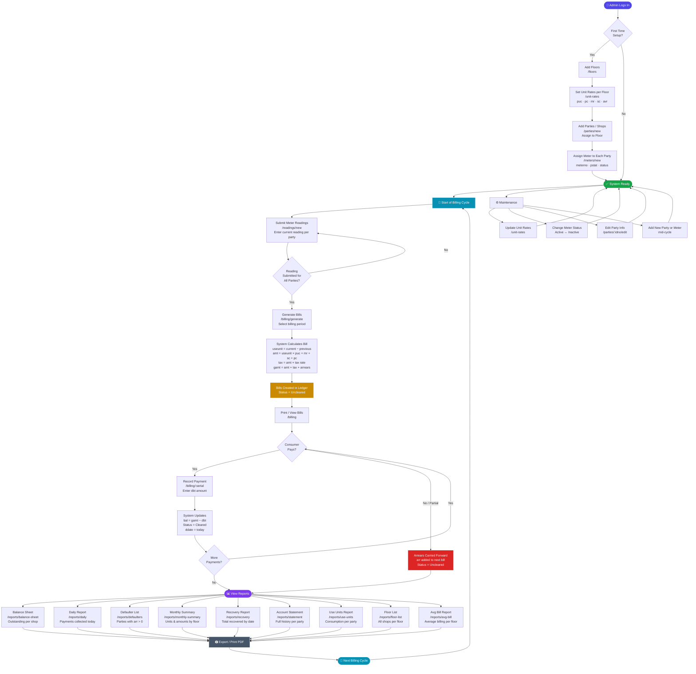

# Electricity Billing System — End-to-End User Journey

```mermaid
flowchart TD
    A([👤 Admin Logs In]) --> B{First Time\nSetup?}

    %% ─── SETUP FLOW ───
    B -- Yes --> S1[Add Floors\n/floors]
    S1 --> S2[Set Unit Rates per Floor\n/unit-rates\npuc · pc · mr · sc · avr]
    S2 --> S3[Add Parties / Shops\n/parties/new\nAssign to Floor]
    S3 --> S4[Assign Meter to Each Party\n/meters/new\nmeterno · pstat · status]
    S4 --> READY([✅ System Ready])

    %% ─── RETURNING USER ───
    B -- No --> READY

    %% ─── MONTHLY BILLING CYCLE ───
    READY --> C[📅 Start of Billing Cycle]

    C --> D[Submit Meter Readings\n/readings/new\nEnter current reading per party]

    D --> E{Reading\nSubmitted for\nAll Parties?}
    E -- No --> D
    E -- Yes --> F[Generate Bills\n/billing/generate\nSelect billing period]

    F --> G[System Calculates Bill\nuseunit = current − previous\namt = useunit × puc + mr + sc + pc\ntax = amt × tax rate\ngamt = amt + tax + arrears]

    G --> H[Bills Created in Ledger\nStatus = Uncleared]

    %% ─── PAYMENT FLOW ───
    H --> I[Print / View Bills\n/billing]

    I --> J{Consumer\nPays?}

    J -- Yes --> K[Record Payment\n/billing/:serial\nEnter dbt amount]
    K --> L[System Updates\nbal = gamt − dbt\nStatus = Cleared\nddate = today]
    L --> M{More\nPayments?}
    M -- Yes --> J
    M -- No --> N

    J -- No / Partial --> P[Arrears Carried Forward\narr added to next bill\nStatus = Uncleared]
    P --> N

    %% ─── REPORTS ───
    N([📊 View Reports])

    N --> R1[Balance Sheet\n/reports/balance-sheet\nOutstanding per shop]
    N --> R2[Daily Report\n/reports/daily\nPayments collected today]
    N --> R3[Defaulter List\n/reports/defaulters\nParties with arr > 0]
    N --> R4[Monthly Summary\n/reports/monthly-summary\nUnits & amounts by floor]
    N --> R5[Recovery Report\n/reports/recovery\nTotal recovered by date]
    N --> R6[Account Statement\n/reports/statement\nFull history per party]
    N --> R7[Use Units Report\n/reports/use-units\nConsumption per party]
    N --> R8[Floor List\n/reports/floor-list\nAll shops per floor]
    N --> R9[Avg Bill Report\n/reports/avg-bill\nAverage billing per floor]

    R1 & R2 & R3 & R4 & R5 & R6 & R7 & R8 & R9 --> EX[🖨️ Export / Print PDF]

    EX --> NEXT([🔄 Next Billing Cycle])
    NEXT --> C

    %% ─── MAINTENANCE FLOWS ───
    READY --> M1[⚙️ Maintenance]
    M1 --> M2[Update Unit Rates\n/unit-rates]
    M1 --> M3[Change Meter Status\nActive ↔ Inactive]
    M1 --> M4[Edit Party Info\n/parties/:idno/edit]
    M1 --> M5[Add New Party or Meter\nmid-cycle]

    M2 & M3 & M4 & M5 --> READY

    %% ─── STYLES ───
    style A fill:#4f46e5,color:#fff,stroke:none
    style READY fill:#16a34a,color:#fff,stroke:none
    style C fill:#0891b2,color:#fff,stroke:none
    style H fill:#ca8a04,color:#fff,stroke:none
    style N fill:#7c3aed,color:#fff,stroke:none
    style EX fill:#475569,color:#fff,stroke:none
    style NEXT fill:#0891b2,color:#fff,stroke:none
    style P fill:#dc2626,color:#fff,stroke:none
```
