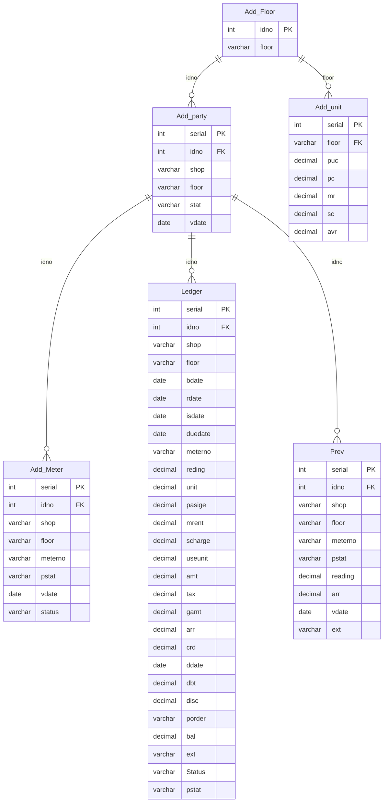

```mermaid
erDiagram
    Add_Floor {
        int idno PK
        varchar floor
    }

    Add_party {
        int serial PK
        int idno FK
        varchar shop
        varchar floor
        varchar stat
        date vdate
    }

    Add_Meter {
        int serial PK
        int idno FK
        varchar shop
        varchar floor
        varchar meterno
        varchar pstat
        date vdate
        varchar status
    }

    Add_unit {
        int serial PK
        varchar floor FK
        decimal puc
        decimal pc
        decimal mr
        decimal sc
        decimal avr
    }

    Ledger {
        int serial PK
        int idno FK
        varchar shop
        varchar floor
        date bdate
        date rdate
        date isdate
        date duedate
        varchar meterno
        decimal reding
        decimal unit
        decimal pasige
        decimal mrent
        decimal scharge
        decimal useunit
        decimal amt
        decimal tax
        decimal gamt
        decimal arr
        decimal crd
        date ddate
        decimal dbt
        decimal disc
        varchar porder
        decimal bal
        varchar ext
        varchar Status
        varchar pstat
    }

    Prev {
        int serial PK
        int idno FK
        varchar shop
        varchar floor
        varchar meterno
        varchar pstat
        decimal reading
        decimal arr
        date vdate
        varchar ext
    }

    Add_Floor  ||--o{ Add_party  : "idno"
    Add_Floor  ||--o{ Add_unit   : "floor"
    Add_party  ||--o{ Add_Meter  : "idno"
    Add_party  ||--o{ Ledger     : "idno"
    Add_party  ||--o{ Prev       : "idno"
```
